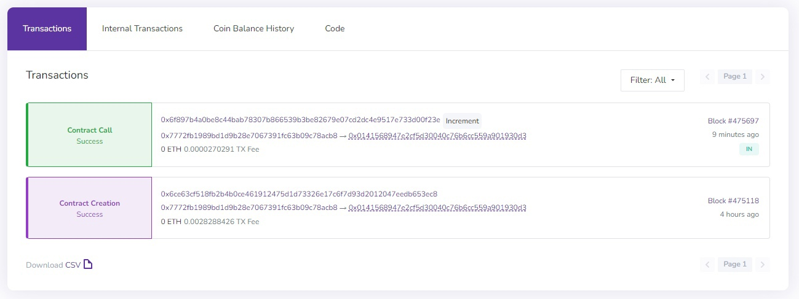

# stylus-minimal-project

1. Install the Stylus CLI tool by running the following command:

```bash
RUSTFLAGS="-C link-args=-rdynamic" cargo install --force cargo-stylus
```

2. Add WASM (WebAssembly) as a build target for your Rust compiler with the following command:

```bash
rustup target add wasm32-unknown-unknown
```

You should now have it available as a cargo command:

```bash
cargo stylus --help

Cargo command for developing Arbitrum Stylus projects

Usage:
    cargo stylus new
    cargo stylus export-abi
    cargo stylus check
    cargo stylus deploy
```

3. To check whether or not your program will successfully deploy and activate onchain, use the subcommand:

```bash
cargo stylus check
```

To read more about what counts as valid vs. invalid user WASM programs, see [VALID_WASM](https://github.com/OffchainLabs/cargo-stylus/blob/main/VALID_WASM.md). If your program succeeds, you'll see the following message:

```bash
Finished release [optimized] target(s) in 1.88s
Reading WASM file at hello-stylus/target/wasm32-unknown-unknown/release/hello-stylus.wasm
Compressed WASM size: 3 KB
Program succeeded Stylus onchain activation checks with Stylus version: 1
```

4. Next, attempt an actual deployment. Two transactions will be sent onchain.

```bash
cargo stylus deploy \
  --private-key-path=<PRIVKEY_FILE_PATH>
```

More options exist for sending and outputting your transaction data. See ```cargo stylus deploy --help``` for more details.
To see provided transactions go to the [testnet](https://stylus-testnet-explorer.arbitrum.io/) and enter your program address. You would see something like this:

